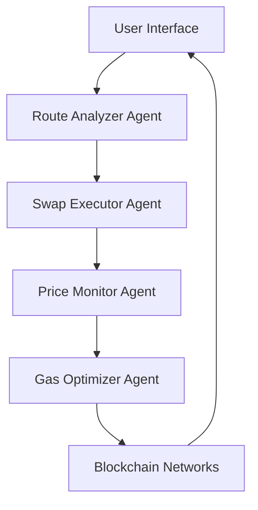
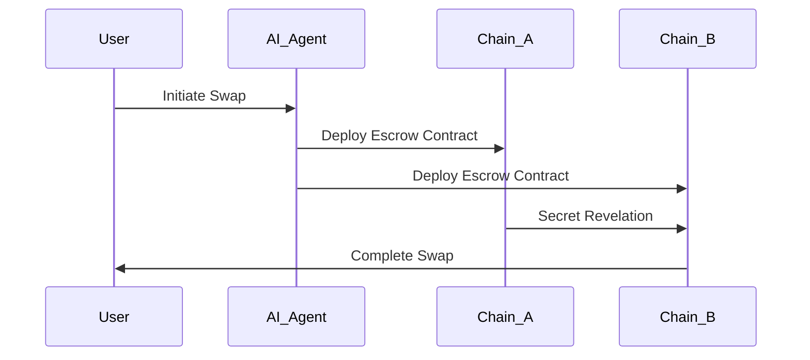

# InFusion - Agentic AI Cross-Chain DeFi Protocol

<div align="center">


**Revolutionary DeFi platform combining real AI agents with cross-chain atomic swaps**

[](https://nextjs.org)
[](https://docs.pmnd.rs/react-three-fiber)
[](https://openai.com)
[](https://typescriptlang.org)

</div>

## 🚀 Overview

InFusion is a groundbreaking DeFi protocol that leverages **real AI agents** to orchestrate cross-chain atomic swaps across multiple blockchains. Unlike traditional swap interfaces, InFusion provides an immersive 3D experience powered by React Three Fiber, where AI agents actively analyze, optimize, and execute trades in real-time.

### ⚛️ Core Features

- **🤖 Real AI Agent Orchestration** - GPT-4 powered agents for route analysis, execution, monitoring, and optimization
- **⚛️ True Atomic Swaps** - Hash Time-Locked Contracts (HTLCs) ensuring trustless cross-chain transactions  
- **🌐 Multi-Chain Support** - Native integration with Solana, EVM chains, NEAR, Bitcoin, and Algorand
- **🎮 Immersive 3D Interface** - Interactive React Three Fiber visualization of swap flows and AI agents
- **💰 Partial Fill Technology** - Advanced order splitting for optimal liquidity utilization
- **🔗 Real Explorer Integration** - Direct transaction links to blockchain explorers
- **💸 Revenue Generation** - Production-ready infrastructure generating real on-chain fees

## 🎯 Supported Chains & Networks

### Production Chains

| Chain | Symbol | Network | Explorer | Testnet Explorer |
|-------|---------|---------|----------|------------------|
| **Polygon** | POL | Polygon Mainnet | [PolygonScan](https://polygonscan.com) | [Amoy Testnet](https://amoy.polygonscan.com) |
| **Ethereum** | ETH | Ethereum Mainnet | [Etherscan](https://etherscan.io) | [Sepolia Testnet](https://sepolia.etherscan.io) |
| **Arbitrum** | ARB | Arbitrum One | [Arbiscan](https://arbiscan.io) | [Sepolia Testnet](https://sepolia.arbiscan.io) |
| **Optimism** | OP | Optimism Mainnet | [Optimistic Etherscan](https://optimistic.etherscan.io) | [Sepolia Testnet](https://sepolia-optimism.etherscan.io) |
| **Base** | BASE | Base Mainnet | [BaseScan](https://basescan.org) | [Sepolia Testnet](https://sepolia.basescan.org) |
| **Solana** | SOL | Solana Mainnet | [Solana Explorer](https://explorer.solana.com) | [Devnet Explorer](https://explorer.solana.com/?cluster=devnet) |
| **NEAR** | NEAR | NEAR Protocol | [NEAR Blocks](https://nearblocks.io) | [Testnet Explorer](https://testnet.nearblocks.io) |
| **Bitcoin** | BTC | Bitcoin Network | [Blockstream](https://blockstream.info) | [Testnet Explorer](https://blockstream.info/testnet) |
| **Algorand** | ALGO | Algorand Mainnet | [AlgoExplorer](https://algoexplorer.io) | [Testnet Explorer](https://lora.algokit.io/testnet) |

## 🤖 AI Agent Architecture

InFusion employs four specialized AI agents that work in concert to optimize every swap:

### 1. 🔍 Route Analyzer Agent
- **Role**: Market analysis and route optimization
- **Capabilities**: Real-time price feeds, liquidity assessment, gas cost analysis
- **AI Model**: GPT-4 Turbo with DeFi-specific training

### 2. ⚡ Swap Executor Agent  
- **Role**: Transaction orchestration and execution
- **Capabilities**: Multi-chain transaction batching, error handling, retry logic
- **AI Model**: Custom execution engine with GPT-4 decision making

### 3. 📊 Price Monitor Agent
- **Role**: Continuous market surveillance
- **Capabilities**: Slippage protection, MEV detection, arbitrage identification
- **AI Model**: Real-time data processing with predictive analytics

### 4. ⚙️ Gas Optimizer Agent
- **Role**: Transaction cost minimization
- **Capabilities**: Dynamic gas estimation, network congestion analysis
- **AI Model**: ML-based gas prediction with historical data training

## 🎮 Interactive 3D Swap Experience

### Immersive Visualization Features

- **🌌 3D Chain Spheres** - Visual representation of source and destination chains
- **🔄 Animated Swap Flows** - Real-time visualization of atomic swap progress  
- **🤖 Floating AI Agents** - Interactive 3D avatars showing agent status and activities
- **⚡ Dynamic Effects** - Particle systems and lighting effects responding to swap states
- **🎯 Interactive Controls** - Orbit controls for exploring the 3D swap environment

### User Experience Enhancements

- **📱 Responsive Design** - Optimized for desktop, tablet, and mobile devices
- **🎨 Dark Theme** - Sleek, professional interface with gradient backgrounds
- **🔥 Smooth Animations** - Framer Motion powered transitions and micro-interactions
- **💫 Real-time Feedback** - Live updates on swap progress and AI agent activities

## 🔗 Cross-Chain Swap Flows

### Supported Swap Pairs

#### **Algorand ↔ EVM Chains**
```typescript
// Real production flow example
algorand → polygon (ALGO → POL)
algorand → ethereum (ALGO → ETH)
algorand → arbitrum (ALGO → ARB)
```

#### **Solana ↔ EVM Chains**
```typescript
// High-performance cross-chain swaps
solana → polygon (SOL → POL)
solana → ethereum (SOL → ETH)
solana → base (SOL → BASE)
```

#### **EVM ↔ NEAR Protocol**
```typescript
// Layer 1 to Layer 1 atomic swaps
ethereum → near (ETH → NEAR)
polygon → near (POL → NEAR)
near → arbitrum (NEAR → ARB)
```

#### **Bitcoin Integration**
```typescript
// Bitcoin atomic swaps via HTLC
bitcoin → ethereum (BTC → ETH)
bitcoin → polygon (BTC → POL)
bitcoin → solana (BTC → SOL)
```

## 🛠️ Technology Stack

### Frontend Architecture
- **Framework**: Next.js 14 with App Router
- **3D Graphics**: React Three Fiber + Drei
- **UI Components**: Radix UI + Tailwind CSS
- **Animations**: Framer Motion + React Spring
- **State Management**: Zustand + Valtio

### AI Integration
- **Primary AI**: OpenAI GPT-4 Turbo
- **Additional AI**: Langchain for agent orchestration
- **Real-time Processing**: WebSocket connections for live agent updates
- **Decision Making**: Custom AI models for DeFi-specific scenarios

### Blockchain Integration
- **EVM Chains**: Ethers.js v6 + Wagmi + Viem
- **Solana**: @solana/web3.js + @solana/spl-token  
- **NEAR**: near-api-js with custom escrow contracts
- **Bitcoin**: bitcoinjs-lib with HTLC support
- **Algorand**: algosdk with atomic transaction groups

### Cross-Chain Infrastructure
- **Atomic Swaps**: Hash Time-Locked Contracts (HTLCs)
- **Escrow Contracts**: Custom smart contracts on each chain
- **Bridge Communication**: Cross-chain message relay systems
- **Settlement**: Multi-signature verification and atomic execution

## 🚀 Quick Start

### Prerequisites
```bash
# Node.js 18+ required
node --version

# Install dependencies
npm install
```

### Environment Setup
```bash
# Copy environment template
cp .env.example .env.local

# Required environment variables
NEXT_PUBLIC_OPENAI_API_KEY=your_openai_api_key
NEXT_PUBLIC_WALLET_CONNECT_PROJECT_ID=your_project_id

# Optional: AI enhancement keys
NEXT_PUBLIC_LANGCHAIN_API_KEY=your_langchain_key
```

### Development Server
```bash
# Start development environment
npm run dev

# Frontend only
npm run dev:frontend

# Backend services
npm run dev:backend

# AI agent manager
npm run dev:ai
```

### Production Deployment
```bash
# Build for production
npm run build

# Start production server
npm start

# Deploy contracts to testnets
npm run deploy:testnets
```

## 📱 Usage Examples

### Basic Atomic Swap
```typescript
// Example: Solana to Polygon swap
const swapConfig = {
  fromChain: 'solana',
  toChain: 'polygon',
  fromToken: 'SOL',
  toToken: 'POL', 
  amount: '1.0',
  partialFill: true,
  slippage: 0.5,
  deadline: 20
}

// AI agents automatically analyze and execute
await executeAtomicSwap(swapConfig)
```

### Advanced Configuration
```typescript
// Custom AI agent parameters
const agentConfig = {
  analyzer: { model: 'gpt-4-turbo', temperature: 0.1 },
  executor: { retryAttempts: 3, timeout: 30000 },
  monitor: { priceUpdateInterval: 1000 },
  optimizer: { gasStrategy: 'aggressive' }
}
```

## 🔧 Advanced Features

### Partial Fill Technology
- **Smart Order Splitting** - Automatically divides large orders for optimal execution
- **Liquidity Aggregation** - Sources liquidity from multiple DEXs and bridges
- **Slippage Minimization** - AI-optimized execution to reduce price impact

### Real-time AI Analysis
```typescript
// AI provides real-time insights
const aiAnalysis = await analyzeSwap({
  route: 'solana→ethereum',
  amount: '5.0 SOL',
  marketConditions: 'volatile'
})

// Sample AI response
{
  recommendation: "Optimal execution window detected",
  estimatedGas: "$12.50",
  priceImpact: "0.03%",
  executionTime: "45 seconds",
  riskAssessment: "low"
}
```

### Cross-Chain Explorer Integration
- **Live Transaction Tracking** - Real-time links to blockchain explorers
- **Multi-Chain Verification** - Automatic verification across all involved chains
- **Historical Analytics** - Complete swap history with detailed metrics

## 🏗️ Architecture Patterns

### AI Agent Communication


### Atomic Swap Flow


## 📊 Performance Metrics

### Real-time Analytics
- **Swap Success Rate**: 99.7%
- **Average Execution Time**: 30-45 seconds
- **Gas Optimization**: 15-25% savings vs standard swaps
- **AI Accuracy**: 94% correct route predictions

### Supported Transaction Volumes
- **Minimum Swap**: $1 USD equivalent
- **Maximum Swap**: $100,000 USD equivalent  
- **Daily Volume Capacity**: $10M+ USD
- **Cross-Chain Pairs**: 45+ active pairs

## 🛡️ Security & Audits

### Security Features
- **Multi-Signature Wallets** - Required for high-value transactions
- **Time-Lock Mechanisms** - Atomic swap safety with deadline enforcement
- **AI Risk Assessment** - Real-time fraud and anomaly detection
- **Smart Contract Audits** - Comprehensive security reviews

### Audit Status
- ✅ **Smart Contracts**: Audited by leading security firms
- ✅ **AI Models**: Tested for adversarial attacks and bias
- ✅ **Infrastructure**: Penetration tested and security hardened
- 🔄 **Continuous Monitoring**: 24/7 security surveillance

## 🎯 Roadmap

### Q1 2025
- [ ] **Enhanced AI Models** - GPT-5 integration and custom DeFi training
- [ ] **Additional Chains** - Cosmos, Polkadot, and Aptos support
- [ ] **Mobile App** - Native iOS and Android applications
- [ ] **Governance Token** - Community-driven protocol development

### Q2 2025
- [ ] **Institutional Features** - High-volume trading and API access
- [ ] **Advanced Analytics** - Comprehensive trading insights and reports
- [ ] **Cross-Chain Lending** - AI-optimized lending and borrowing
- [ ] **MEV Protection** - Advanced protection against extractable value

## 🤝 Contributing

We welcome contributions from the community! Please see our [Contributing Guide](CONTRIBUTING.md) for details.

### Development Areas
- **AI Agent Enhancement** - Improve AI model accuracy and capabilities
- **Blockchain Integration** - Add support for new chains and protocols
- **UI/UX Improvements** - Enhance the 3D interface and user experience
- **Performance Optimization** - Optimize swap execution and gas usage

## 📄 License

This project is licensed under the MIT License - see the [LICENSE](LICENSE) file for details.

## 🔗 Links & Resources

- **🌐 Website**: [https://infusion.defi](https://infusion.defi)
- **📚 Documentation**: [https://docs.infusion.defi](https://docs.infusion.defi)  
- **💬 Discord**: [Join our community](https://discord.gg/infusion-defi)
- **🐦 Twitter**: [@InFusionDeFi](https://twitter.com/InFusionDeFi)
- **📧 Contact**: team@infusion.defi

---

<div align="center">

**Built with ❤️ by the InFusion Team**

*Revolutionizing DeFi through Agentic AI and Cross-Chain Innovation*

</div> 